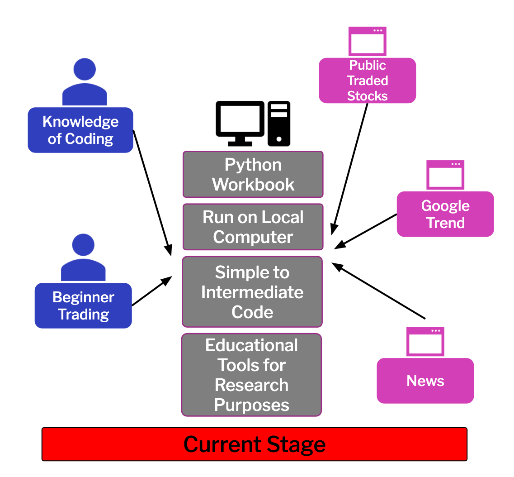
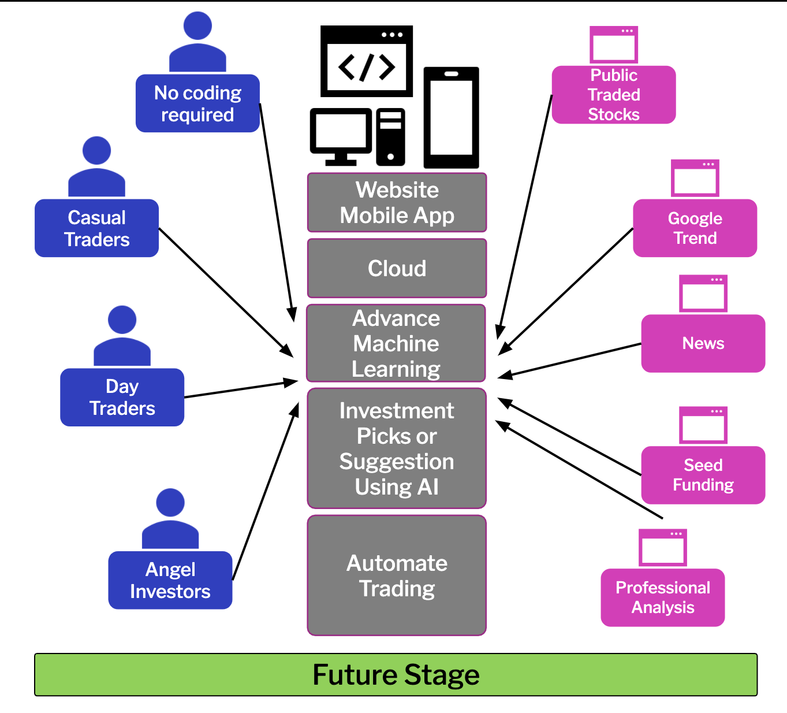

# STOCK HERO

## AGENDA

- STOCK HERO
- MARKET
- CODING
- FUTURE STAGE

### STOCK HERO

Stock Hero is an individual stock analyzer/forecaster designed by developers based out of California, USA. Our mission is to equip beginner traders/investors with a tool to accelerate their understanding of individual stocks, by providing an analyzation and forecast for each query.

### MARKET

Our Target Audience: Beginner Traders/Investors

Why: Our project is intended for the beginner trader/investor audience who are trying to gain a better understanding of specific stocks.

We are marketing towards people new to the stock market and investing in general because sometimes starting is the hardest part.

### CODING

Included libraries:
- Pandas
- Numpy 
- News API 
- Alpaca API

Giving a ticker stock, stock hero will show:
- Five most related news in the las month for the company given
- Using Montecarlo simulation using 10 years of data and projecting out to 5 years the estimated rage value 
- Comparisonfor the company to indexed stocks SPY and DIA

